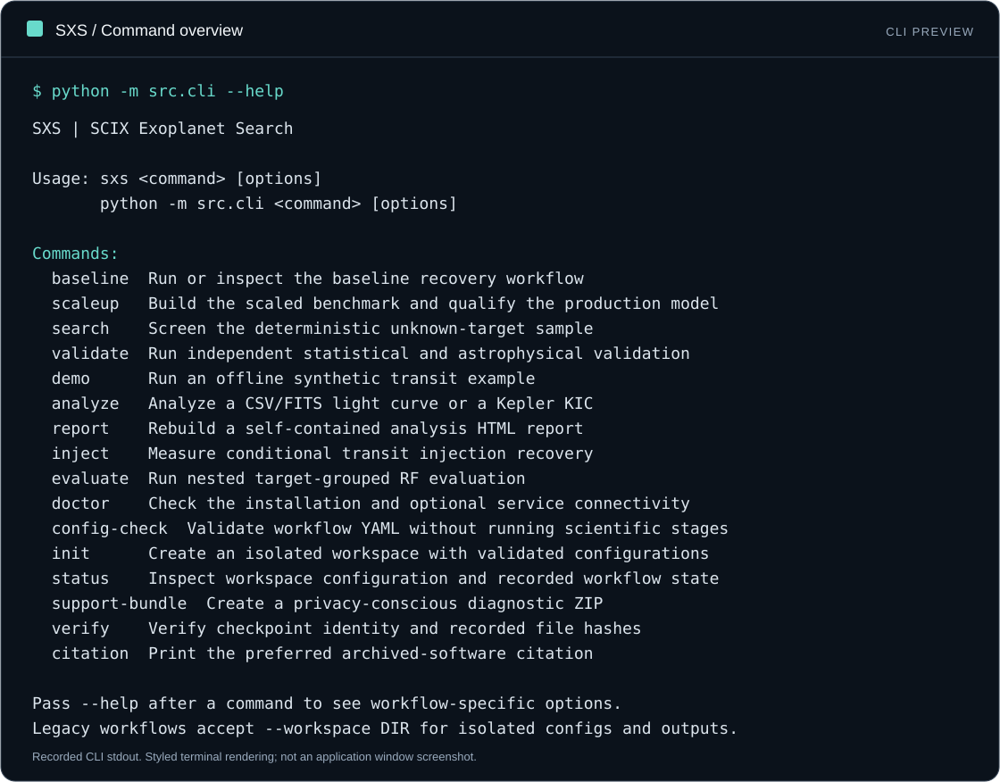

<picture>
  <source media="(prefers-color-scheme: dark)" srcset="./assets/scix-banner-wide.png">
  <source media="(prefers-color-scheme: light)" srcset="./assets/scix-banner-centered.png">
  
</picture>

# Exoplanet Search

### Reproducible transit recovery. Independent scientific review.

**A computational astronomy project by Science Experimental Technologies (SCIX).**

[Explore the project](https://github.com/Science-Experimental-Technologies/Exoplanet-Search) · [Read the documentation](https://science-experimental-technologies.github.io/Exoplanet-Search/) · [Contact the team](mailto:scix.official@gmail.com)

**Brand palette:** `#0B0F16` · `#075BFF` · `#F5F7FA`

---

## About

Science Experimental Technologies develops Exoplanet Search, a computational astronomy pipeline for recovering transit-like signals in public Kepler photometry and evaluating them with independent evidence. It combines light-curve processing, period searches, machine-learning ranking, catalog screening, and scientific vetting in a reproducible workflow. The project reports its results with clear limits: its final review found **no confirmed new exoplanets**. Code, methods, and research artifacts are available for inspection under the repository’s source-available license.

## Mission & Vision

**Mission** — Build reproducible tools that make computational astronomy methods and evidence easier to inspect.

**Vision** — Support careful, transparent evaluation of transit signals from data preparation through independent review.

## Research & Engineering Focus

| Focus area | What the project does | Methods and tools |
| --- | --- | --- |
| 🌌 Transit recovery | Processes public Kepler light curves and searches for periodic transit-like signals. | Segment-aware preprocessing, Box Least Squares (BLS) |
| 📈 Signal ranking | Evaluates ranked signals with target-grouped model validation. | Random Forest, compact 1D CNN, grouped cross-validation |
| 🔎 Independent vetting | Screens shortlisted signals using evidence separate from model scores. | Empirical false-alarm analysis, transit fitting, Gaia and TESS checks |
| 🧾 Reproducible research | Preserves configurations, records, reports, and release artifacts for review. | Python CLI, versioned data products, documented workflow |

## Featured Project

| Project | Description | Stack | Release & status |
| --- | --- | --- | --- |
| [Exoplanet Search (SXS)](https://github.com/Science-Experimental-Technologies/Exoplanet-Search) | A reproducible pipeline for Kepler transit recovery, signal ranking, and independent candidate vetting. | Python 3.11–3.12 · NumPy · SciPy · Astropy · Lightkurve · scikit-learn | v1.4.0 · final planned feature release; critical corrections may be considered |

The final independent review assessed **20 shortlisted signals: 0 strong candidates, 1 weak candidate, and 19 likely false positives**. A ranked signal is not a planet probability, and no new planet discovery or confirmation is claimed. See the [results and interpretation guide](https://science-experimental-technologies.github.io/Exoplanet-Search/research/results/) for context.

## See the Workflow

  

The command-line preview is recorded project output, not a graphical application or a new research run. Explore the [copyable CLI examples](https://science-experimental-technologies.github.io/Exoplanet-Search/getting-started/cli-preview/) and [installation guide](https://science-experimental-technologies.github.io/Exoplanet-Search/getting-started/installation/).

## Technology

The project supports Python 3.11 and 3.12. The repository README documents the core and optional scientific dependency profiles, command-line use, and reproducibility steps.

## Why Collaborate

### For Research Institutions

- Review the complete methodology, result records, and release archive before proposing a collaboration.
- Use the documented workflow to reproduce software behavior and examine the scope of the reported results.
- Discuss method review, comparative evaluation, or extensions with the project maintainers.

### For Companies and Technology Teams

- Evaluate the documented pipeline and outputs for research workflows or internal technical assessment.
- Discuss research partnerships, scoped integrations, and commercial licensing before planning material commercial use.
- Review the license terms directly; the project is **source-available, not OSI-approved open-source software**.

### For Contributors

- Improve reproducibility, documentation, packaging, testing, and research workflow quality.
- Review the [contribution guide](https://github.com/Science-Experimental-Technologies/Exoplanet-Search/blob/main/CONTRIBUTING.md) before proposing changes.
- Start with an [open issue labeled `good first issue`](https://github.com/Science-Experimental-Technologies/Exoplanet-Search/issues?q=is%3Aissue+is%3Aopen+label%3A%22good+first+issue%22), or open a focused discussion about a research or engineering question.

## Collaboration & Support

We welcome discussion of **research review, reproducibility, institutional collaboration, mentoring, and licensing**. Sponsorship or commercial arrangements should be discussed with maintainers first so terms can be aligned with the project license.

**Contact:** [scix.official@gmail.com](mailto:scix.official@gmail.com) · [GitHub issues](https://github.com/Science-Experimental-Technologies/Exoplanet-Search/issues) · [YouTube](https://www.youtube.com/@ScExTe)

## Project Status

Version **1.4.0** is the final planned feature release and is archived on [GitHub Releases](https://github.com/Science-Experimental-Technologies/Exoplanet-Search/releases/tag/v1.4.0) and [Zenodo](https://doi.org/10.5281/zenodo.22794079). The repository remains available as a scientific and software record; critical security, packaging, or record-integrity corrections may be considered. Follow the [changelog](https://github.com/Science-Experimental-Technologies/Exoplanet-Search/blob/main/CHANGELOG.md) for project history.

## Trust, Security & Licensing

- [Security policy](https://github.com/Science-Experimental-Technologies/Exoplanet-Search/blob/main/SECURITY.md)
- [Code of Conduct](https://github.com/Science-Experimental-Technologies/Exoplanet-Search/blob/main/CODE_OF_CONDUCT.md)
- [Contributing guide](https://github.com/Science-Experimental-Technologies/Exoplanet-Search/blob/main/CONTRIBUTING.md)
- [Source-Available Commercial License 1.0](https://github.com/Science-Experimental-Technologies/Exoplanet-Search/blob/main/LICENSE)
- [Commercial-use information](https://github.com/Science-Experimental-Technologies/Exoplanet-Search/blob/main/COMMERCIAL_USE.md)
- [Citation and archival DOI](https://doi.org/10.5281/zenodo.22794079)

Please report security issues privately using the instructions in `SECURITY.md`. Do not post exploitable details in public issues. Review the license and `COMMERCIAL_USE.md` before redistributing the software or using it in a commercial project.

## Get Involved

1. **Understand the work:** read the [project overview](https://github.com/Science-Experimental-Technologies/Exoplanet-Search) and [research results](https://science-experimental-technologies.github.io/Exoplanet-Search/research/results/).
2. **Find a contribution:** browse [issues](https://github.com/Science-Experimental-Technologies/Exoplanet-Search/issues) or propose a reproducibility, documentation, or engineering improvement.
3. **Contribute openly:** follow the [contribution guide](https://github.com/Science-Experimental-Technologies/Exoplanet-Search/blob/main/CONTRIBUTING.md) and submit a focused pull request.

For collaboration or licensing inquiries, email [scix.official@gmail.com](mailto:scix.official@gmail.com).

---

**Careful methods. Open records. Evidence first.**

Built by [Science Experimental Technologies](https://github.com/Science-Experimental-Technologies).

